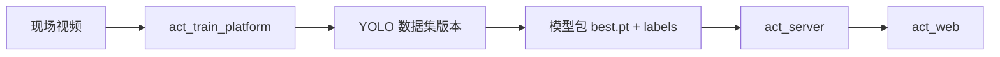

# act_train_platform 架构说明

## 1. 系统边界

`act_train_platform` 是模型生产端。

它的输出是模型包，输入给 `act_server`。它不参与产线实时推理。



## 2. 技术栈

- FastAPI：后端服务和 API。
- Jinja2：服务端页面模板。
- 原生 JavaScript：页面交互和标注画布。
- SQLite：业务元数据。
- 文件目录：视频、帧、数据集、训练输出、模型包。
- Ultralytics YOLO：训练、预标注、模型导出。

## 3. 核心数据

- `labels`：全局标签字典。
- `projects`：训练项目。
- `videos`：导入视频。
- `frame_sets` / `frames`：抽帧任务和帧。
- `tracks` / `annotations`：轨迹、关键帧、插值框、预标注框。
- `dataset_versions`：不可变数据集版本。
- `train_jobs`：训练任务。
- `model_packages`：导出的模型包。

## 4. 标注状态

标注框的 `source` 表示来源：

- `manual`：人工标注。
- `interpolated`：轨迹插值生成。
- `prelabel`：旧模型预标注生成。

`confirmed=false` 的框不会进入数据集导出。预标注结果默认未确认。

## 5. 插值逻辑

第一版只做 bbox 线性插值：

- 同一 `track_id` 下至少两个关键帧。
- 按帧顺序取相邻关键帧。
- 对 `x/y/w/h` 分别做线性插值。
- 只删除并重算该轨迹旧的插值框，不影响其他轨迹和其他对象。

## 6. 训练逻辑

训练任务读取数据集版本目录下的 `dataset.generated.yaml`，使用 Ultralytics Python API：

```python
YOLO(base_model_path).train(...)
```

训练输出放在：

```text
data/runs/<project_id>/<train_job_id>/train/
```

模型包导出时读取：

```text
data/runs/<project_id>/<train_job_id>/train/weights/best.pt
```
